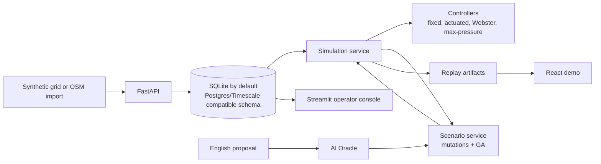

# Traffic Digital Twin

Traffic-management take-home prototype with:

- A deterministic synthetic-grid simulator that works without SUMO
- `fixed-time`, `actuated`, `Webster`, `max-pressure`, and `GA-optimized` controllers
- A scenario engine with constrained AI proposal parsing
- FastAPI endpoints, a Streamlit operator console, and a React-based replay demo

## One-command start

```bash
python3 -m pip install --user ".[dev]"
PYTHONPATH=src python3 -m traffic_simulator.dev_servers
```

This starts:

- API: `http://127.0.0.1:8000`
- Demo UI: `http://127.0.0.1:8000/demo/`
- Streamlit: `http://127.0.0.1:8501`

## Architecture



## Current implementation notes

- The repository uses the guaranteed-working fallback path first: `SQLite + NetworkX + seeded 4x4 grid`.
- The API includes an OSM import seam. If `osmnx` is installed, you can call `POST /networks/load` with `source_type=osm`.
- The persistence model mirrors the take-home architecture even though the local default runtime is SQLite.

## Example workflow

1. Load a network:

```bash
curl -X POST http://127.0.0.1:8000/networks/load \
  -H 'content-type: application/json' \
  -d '{"source_type":"synthetic","name":"grid-demo","seed":7,"grid_config":{"rows":4,"cols":4}}'
```

2. Run a simulation:

```bash
curl -X POST http://127.0.0.1:8000/simulations/run \
  -H 'content-type: application/json' \
  -d '{"network_id":"<network_id>","controller_mode":"max_pressure","seed":7,"duration_s":300}'
```

3. Parse a natural-language proposal:

```bash
curl -X POST http://127.0.0.1:8000/scenarios/parse-proposal \
  -H 'content-type: application/json' \
  -d '{"network_id":"<network_id>","proposal_text":"replace this signal with a roundabout near the busiest destination and compare travel times"}'
```

## Tests

```bash
PYTHONPATH=src pytest
```
