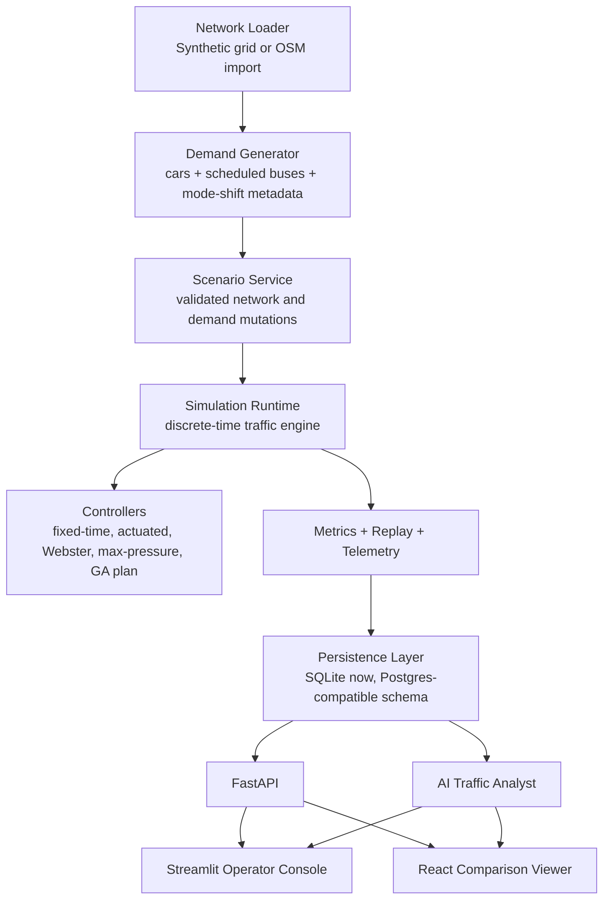

# Andrew's Traffic Analyzer

## Architecture Memo and Technical Decision Record

### 1. Executive Summary

This project addresses a city-traffic optimization problem with two very different planning horizons. At the micro level, the system must improve day-to-day traffic flow by changing signal timing in response to queues, congestion, and incidents. At the macro level, the system must allow planners to test structural proposals such as replacing a signalized intersection with a roundabout, adding a connector or ramp, increasing bus service, or introducing a rail corridor. The core requirement is not just to compute a number, but to support a defensible planning loop: ingest a model of the city, run repeatable simulations, compare baseline versus change, and explain what happened in language that a non-specialist can understand.

The architecture implemented in this repository is deliberately optimized for a take-home environment rather than a city deployment. The system is built around a deterministic, self-contained traffic simulation engine, a scenario service that turns proposals into validated network mutations, several signal-control policies representing progressively stronger control strategies, a lightweight persistence layer that records runs and telemetry, and two user experiences: an operator console for setting up studies and a comparison viewer for replaying and explaining results. An additional AI analyst layer summarizes the outputs of simulations in plain English so that the system remains legible even when the number of runs and metrics grows.

This is the right architecture for the problem because it preserves the spirit of a digital twin without requiring production-scale dependencies. It can answer the key questions the prompt asks, including "what signal policy works better right now?" and "what happens if we change the physical network?", while remaining deterministic, locally runnable, and demonstrable in an interview. The central trade-off is that the system models transportation credibly enough to support comparative analysis, but not with the fidelity of a regional transportation platform. That trade-off is intentional. The goal of the implemented system is to make planning decisions inspectable and testable, not to claim perfect real-world prediction.

### 2. Re-Articulation of the Problem

The underlying problem is not simply "optimize traffic lights." The actual product problem is to provide a planning and operations environment in which a city can combine observed traffic conditions with controllable actions and ask two classes of question. First, at the operational horizon, the city needs controllers that react to recurring rush-hour demand, localized bottlenecks, and disruptions such as accidents. Second, at the planning horizon, the city needs a way to compare the city as it exists today against a modified city in which a road, signal, bus corridor, or rail corridor has changed.

That leads to several architectural consequences. The system must maintain an explicit representation of the transportation network, because optimization and simulation are defined on topology, not just on isolated counts. It must also maintain an explicit representation of travel demand, because every macro proposal is meaningful only relative to who is trying to travel, from where, to where, and when. It must support a scenario model, because the macro questions are fundamentally "counterfactual network" problems. It must produce repeatable output, because planners and interviewers alike need to trust that a result is not an artifact of a hidden random seed. Finally, it must expose the output in a way that supports both machine evaluation and human understanding.

The original prompt also implies a broader future system with multiple sensors, multiple transportation modes, and periodic simulation studies. This implementation embraces that direction in its architecture even where the current repository uses simplified or stubbed versions. The resulting system is small enough to run in one process but shaped like a real traffic-analysis product.

### 3. Design Goals and Non-Goals

The primary goal was to build a system that is demonstrably useful as a digital twin prototype. That meant the following capabilities were non-negotiable: deterministic synthetic simulation, support for real neighborhood imports, multiple traffic-signal control strategies, macro scenario mutations, stored run results, replay artifacts, and a user-facing explanation layer. A second goal was to preserve a clear line of sight from the current implementation to a production architecture. This is why the repository contains explicit API schemas, a persistence model that mirrors road graph, demand, telemetry, and scenario entities, and a scenario-study abstraction rather than a single monolithic script.

Equally important were the non-goals. The project does not attempt to be a production traffic-management platform. It does not ingest real video, run CV pipelines, consume GTFS feeds, integrate with signal controllers in the field, or coordinate a metropolitan transit network at schedule-optimization fidelity. It does not do user management, permissions, multi-tenant governance, high-availability orchestration, or formal safety certification. Those are the right omissions for a take-home. They remove operational noise while preserving the architectural shape of the underlying problem.

### 4. Chosen Architecture

At a high level, the system is organized into six layers: network and demand modeling, scenario modeling, controller policies, simulation runtime, persistence and APIs, and user-facing explanation and visualization.

This is an ideal architecture for the assignment because it separates the three things that are easy to conflate in a smaller prototype: what the city looks like, how traffic behaves on that city, and how the system decides what to do. Network loading and demand generation are responsible for producing a city state. The scenario service is responsible for producing counterfactual versions of that city. The simulation runtime is responsible for moving demand through a network. The controller layer is responsible only for signal decisions, not for physical network mutations. That separation is what makes a study such as "baseline city versus changed city across three controllers and three seeds" both tractable and explainable.

### 5. Why This Architecture Was Chosen Instead of a Heavier One

The original plan called out a target architecture based on FastAPI, SUMO or libsumo, and Postgres with PostGIS and TimescaleDB. That remains a sensible target architecture for a larger system, but it is not the architecture that best serves a local take-home prototype. A SUMO-first implementation would have brought stronger realism, but it would also have introduced significant operational overhead, conversion complexity, and demo fragility. Similarly, a PostGIS-plus-Timescale stack would have aligned cleanly with a city-scale persistence story, but it would have increased startup complexity and introduced more moving parts than necessary for a local interview environment.

The implemented architecture therefore chooses the smallest credible runtime that still preserves the right boundaries. The simulation engine is local and deterministic. The persistence layer defaults to SQLite, but the logical schema already separates networks, nodes, edges, sensors, incidents, scenarios, runs, telemetry, and control actions in a way that maps cleanly onto a heavier relational backend later. The application exposes APIs even though all components could have been wired together in-process, because the API boundary is part of the architecture story. In short, the design optimizes for credibility per unit of complexity.

### 6. Runtime Architecture in More Detail

The system starts by loading a network. In synthetic mode, it builds a deterministic rectangular street grid with bidirectional edges and signalized nodes. In real-neighborhood mode, it uses OSMnx to geocode a place name, extract a compact drivable graph, reduce it to a manageable neighborhood-sized subgraph, and project that graph into a format the simulator and viewer can consume. Both paths produce the same internal `TrafficNetwork` abstraction. This is an important decision: every downstream component operates on one consistent domain model rather than on separate synthetic and OSM code paths. That reduces branching throughout the system and makes the "demo grid first, real map second" rollout possible without architectural duplication.

Demand generation is built directly on that network abstraction. The demand model creates repeatable car trips, identifies hotspots and boundary nodes, and synthesizes bus service along major corridors. For synthetic grids, this is done with weighted origin-destination logic that creates realistic directional pressure around hotspots. For OSM networks, the generator biases trips toward central activity nodes and boundary nodes and uses short random walks plus shortest-path checks to keep trip lengths plausible for a compact neighborhood. This is not an attempt to solve full travel-demand modeling. It is a design that produces demand rich enough to expose controller differences and scenario effects without requiring real OD matrices.

The scenario service then sits above the base network and demand. Its job is to convert a proposal into explicit, validated mutations. A signal-to-roundabout change becomes a node control-type change. A connector proposal becomes a new edge with lane count and speed attributes. A bus-service increase becomes additional transit trips plus a mode-shift reduction in car trips. A light-rail corridor becomes a transit overlay plus a more aggressive mode shift away from cars. An accident scenario becomes an edge closure or capacity drop. This service is where macro planning becomes concrete. It is also where the architecture protects itself from arbitrary AI behavior by restricting proposals to a small, typed mutation vocabulary.

The simulation runtime is a discrete-time engine. At each second, it spawns departures, advances vehicles on active edges, builds queue and downstream-pressure state, asks the active controller for phase decisions, applies those decisions, moves queued vehicles through intersections if the phase allows it, and records replay and telemetry state. Because the runtime owns the movement rules and the controllers only produce phase choices, the simulator can compare control policies fairly while reusing the same movement model and demand profile across runs.

Persistence is organized around durable study artifacts. Networks, demand profiles, incidents, scenarios, simulation runs, telemetry events, and control actions are written into relational tables. Replay artifacts are written separately as JSON files and then reconstructed through the API into viewer payloads. This split is intentional. High-volume frame data is awkward to store in a local relational database and not useful for query-driven analytics, while summary metrics and telemetry are. The repository therefore keeps the relational store focused on structured operational data and the artifacts directory focused on replay payloads.

### 7. Why the Architecture Is a Good Match for the Take-Home

The architecture succeeds on the dimensions that matter for this exercise. It is conceptually rigorous enough to resemble a real product. It handles both micro-optimization and macro what-if studies. It makes repeatability a first-class property rather than a testing afterthought. It has a clear user-facing control plane and a separate visual explanation plane. It also exposes enough seams that one could credibly talk about how to evolve it into a larger transportation platform without pretending that the demo itself is already such a platform.

An equally important virtue is that the system is explainable. The simulation engine is local and readable. The controller logic is implemented as explicit policy classes. The scenario layer shows exactly how a proposal becomes a changed network or changed demand. The AI layer summarizes results, but it does not own any safety-critical state transitions. That division between algorithmic decision-making and explanatory AI is a particularly good choice for an interview project because it allows the system to use AI where it adds clarity without allowing AI to become a source of hidden behavior.

### 8. Full Production Architecture and What Was Stubbed Out

If this system were extended into a complete production platform, several components would become substantially more sophisticated. The network layer would likely use PostGIS-backed network storage with versioned city snapshots, richer lane geometry, turn restrictions, signal groups, and hierarchy-aware road classes. Demand generation would be replaced or supplemented with real observed OD matrices, GTFS feeds, bus stop dwell modeling, event calendars, and time-of-day demand patterns derived from historical telemetry. The simulator would likely move onto SUMO, Aimsun, MATSim, or a hybrid mesoscopic engine, especially if the scope expanded beyond compact neighborhoods. The telemetry plane would ingest real intersection counts, speed probes, incident reports, and potentially computer-vision outputs. The optimization plane would eventually include corridor coordination, bus headway control, lane-use strategies, and offline network design optimization with stronger safety and fairness constraints.

This repository intentionally stubs or simplifies several of those areas. Cameras are represented as derived telemetry rather than raw video. Buses and rail exist as demand and overlay abstractions rather than as full schedule and station operations. Incidents are modeled as capacity and speed reductions rather than full crash-recovery workflows. Real-map import is neighborhood-sized and compacted to keep the simulator interactive. The AI proposal parser is constrained to typed mutations rather than open-ended plan synthesis. The reason is not that those omitted pieces are unimportant. The reason is that, for a take-home, they are not the highest-leverage place to spend complexity budget. The assignment is really asking whether the candidate can frame and implement the right system boundaries. This project spends its complexity where those boundaries matter.

### 9. Technical and Algorithmic Decisions

#### 9.1 Domain Model First

The first major decision was to define explicit domain objects for nodes, edges, trips, incidents, mutations, scenarios, and phase decisions. The alternative would have been to pass dictionaries through the entire system. That would have been faster to prototype, but much worse for correctness and explanation. The domain model provides a stable language for everything else in the repository: network loaders return `TrafficNetwork`, controllers consume network and demand profile abstractions, scenarios mutate typed objects, and persistence converts those objects into storage representations. The trade-off is some boilerplate and serialization work. The benefit is architectural clarity and a much easier path to extension.

#### 9.2 Deterministic Synthetic Grid as the Guaranteed-Working Base

The synthetic grid was chosen as the guaranteed-working environment because it guarantees a controllable topology, fast startup, and deterministic behavior. A real-map-first approach would have looked more impressive in screenshots, but it would have made debugging harder and would have exposed the user to external fragility at the earliest stage of the workflow. The grid lets the system prove signal-control behavior, replay, AI explanation, and scenario mutation on a controlled map before stepping up to a real neighborhood. This choice trades away realism in the first-run experience in order to guarantee that the core loop always works.

#### 9.3 OSM Import as a Second Network, Not the Primary Runtime

The OSM import seam exists to show that the architecture is not trapped in a toy world. The network loader uses OSMnx to geocode a place, pull a drivable graph, and compact it to a manageable neighborhood-sized study area. The alternative would have been either to omit real maps entirely or to require prebuilt assets. Omitting real maps would have weakened the project relative to the prompt. Requiring prebuilt assets would have made the system less flexible and less compelling in an interview. The chosen approach accepts limited import latency in exchange for much better product credibility.

#### 9.4 Weighted Demand Generation Instead of `randomTrips.py`

The demand generator creates weighted trips between boundary nodes and hotspots and adds scheduled bus trips. On OSM networks it biases toward central nodes and plausible local travel lengths. The alternative would have been uniformly random OD generation. That would have been easy but visually and analytically weak, because it tends to flatten pressure patterns and understate the usefulness of adaptive control. Another alternative would have been a full activity-based demand model, which would be far beyond the scope of this exercise. The implemented approach sits in the right middle ground: not fully realistic, but realistic enough that controller and scenario differences show up in metrics and replays.

#### 9.5 Separate Controller Layer Instead of Embedding Logic in the Simulator

Controllers implement `initialize`, `observe`, `decide`, and `objective_metrics`, and they return only signal phase decisions. The simulator does not know why a phase was chosen. It only knows how to move vehicles given the active phase. The alternative would have been to hard-code each policy directly into the simulation loop. That would have been simpler initially, but it would have made comparison across policies much harder and would have blurred micro-control logic with the movement model. By keeping controllers separate, the architecture can test multiple policies on identical traffic conditions and reason about them independently.

#### 9.6 Fixed-Time, Actuated, Webster, Max-Pressure, and GA Plan

The controller stack was deliberately chosen to tell a coherent progression story. Fixed-time provides the naive baseline. Actuated adds simple local reactivity. Webster provides a classic fixed-schedule engineering method based on expected flow split. Max-pressure provides the main adaptive controller, using local queue and downstream pressure information plus bus-priority bonuses. GA-optimized plans provide an offline search-based controller that evolves timing plans through repeated simulated evaluation.

This stack was chosen instead of jumping directly to reinforcement learning. RL is a tempting way to make a traffic project sound advanced, but it is a poor default choice for a take-home. It is slower to train, harder to explain, more brittle under environment changes, and more difficult to compare fairly in a compact local environment. Max-pressure, by contrast, has a principled heuristic interpretation and strong practical intuition. Webster provides a good classic benchmark. The GA layer satisfies the "simulation-in-the-loop" spirit of macro optimization without introducing the instability and time cost of RL.

#### 9.7 Bus Priority as a Max-Pressure Extension

Bus service is represented not only in the demand model but also in the real-time controller through a bus-priority bonus in the max-pressure score. The alternative would have been to treat buses exactly like cars or to build a full transit-specific control model. Treating buses like cars would have undercut the project’s claim to handle multimodal city policy. A full transit-control model would have required stop dwell, headway regulation, and route interactions that are out of scope. The chosen design gives buses a meaningful role in controller decisions without exploding model complexity.

#### 9.8 Scenario Mutation Vocabulary Instead of Arbitrary Proposal Execution

The system constrains macro proposals to a small set of validated mutation types such as closing an edge, adding a connector, changing lane count, changing a signal plan, increasing bus service, or adding a light-rail line. The alternative would have been to let an LLM invent arbitrary network edits. That would have made the feature look more magical, but it would also have made the system unpredictable and harder to defend. The chosen design keeps the AI helper in a bounded translation role and leaves actual network changes to deterministic code paths. That is the correct trade-off for trust and repeatability.

#### 9.9 Demand Changes for Bus and Rail Instead of Only Visual Overlays

A crucial design choice was to make transit proposals affect demand, not just rendering. Bus-service increases add trips and remove some car trips from the corridor. Light-rail proposals remove a larger share of car trips and record rail riders served. The alternative would have been to draw bus or rail overlays with no impact on travel. That would have looked good but would not have met the spirit of the prompt. The implemented design is still a simplification, but it preserves the key planning effect: transit investment should change who uses the roads.

#### 9.10 Dynamic Rerouting Under Incidents

The simulator reroutes vehicles using updated edge weights when incidents are active. The alternative would have been to keep routes fixed even after a road closes or degrades. That would have made incident studies less realistic and would have undercut the assignment’s explicit reference to intelligent diversions after accidents. Full dynamic traffic assignment was not implemented because it would add substantial complexity. Instead, the current design reuses shortest-path logic with incident-adjusted edge weights. This captures the qualitative effect of rerouting while staying computationally lightweight.

#### 9.11 SQLite Default with a Postgres-Shaped Schema

The persistence layer defaults to SQLite because the take-home must run locally with minimal setup. The schema, however, is shaped like a more serious backend: separate tables for networks, road nodes, road edges, sensors, demand profiles, incidents, scenarios, simulation runs, telemetry events, and control actions. The alternative would have been to use flat files only, or to require Dockerized Postgres. Flat files would have made querying and replay selection awkward. Dockerized Postgres would have made onboarding heavier than necessary. The chosen approach preserves the relational shape without imposing the operational burden of a heavier database in the default path.

#### 9.12 Replay Artifacts as Files, Metrics as Structured Records

Replay frames and timelines are written to JSON artifacts, while metrics, telemetry, and run metadata are written to the database. This is a storage-design compromise. Keeping frames in the database would have simplified some retrieval paths but would have bloated the local store and made development iteration slower. Keeping everything in files would have made study queries and viewer dropdowns much weaker. The hybrid approach separates high-volume rendering data from queryable analytical state.

#### 9.13 Dual UI Instead of One Compromise Interface

The product has two user surfaces: a Streamlit operator console and a React comparison viewer. This was chosen because the workflow has two very different jobs. The operator needs a high-iteration control plane for loading networks, selecting studies, and launching simulations. The interviewer needs a polished visual surface for replay, side-by-side comparison, and explanation. A single UI would have forced a compromise between operator speed and demo presentation quality. The dual-UI choice accepts some implementation duplication in exchange for better usability in both contexts.

#### 9.14 AI Analyst for Explanation, Not Control

The AI analyst is intentionally positioned after simulation, not inside the decision loop. It summarizes run comparisons and scenario studies in plain English, using xAI when available and deterministic fallbacks otherwise. The alternative would have been either to avoid AI entirely or to make AI responsible for scenario execution or controller decisions. Avoiding AI would have missed an explicit encouragement in the prompt and would have left the interface harder to interpret. Allowing AI to own decisions would have made the system less trustworthy. The chosen design adds explanation, not hidden control.

#### 9.15 Stable IDs and Context Recovery

One subtle but important decision was to make network, demand-profile, and scenario identifiers stable for repeated loads of the same logical city and proposal. Combined with Streamlit-side context recovery, this prevents backend reloads from invalidating the operator session. The alternative was to keep random UUID-style IDs. That was fine at first, but it led to a fragile user experience because a refreshed API process could no longer find objects referenced by the UI. Stable IDs trade away some "new object every time" simplicity in exchange for a dramatically better demo experience and reproducibility.

### 10. Alternatives Considered and Why They Were Not Chosen

Several alternatives were considered implicitly or explicitly and rejected.

A SUMO-first architecture was not chosen as the default because, while more realistic, it would have made the take-home harder to run and harder to debug. Reinforcement learning was not chosen as the main adaptive strategy because it would have absorbed time and complexity without improving interpretability. A single-page UI was not chosen because the control-plane and presentation-plane tasks are different enough to justify separate surfaces. A free-form AI planner was not chosen because typed scenario mutations are much easier to validate and defend. A file-only persistence model was not chosen because scenario studies and replay selection need structured query support. A heavy production database stack was not chosen because local startup simplicity mattered more than backend fidelity for this exercise.

These choices are all instances of the same design philosophy: optimize first for an architecture that is correct in shape, legible in behavior, and reliable in a local demo, then leave clear seams for future production substitutions.

### 11. Operational Limits and Known Simplifications

The system has important limitations that should be stated plainly. Vehicle movement is simplified into edge travel plus queue transfer at nodes. There is no lane-changing model, no turn-pocket physics, no pedestrian interaction, and no spillback across arbitrary geometries. Bus and rail modeling is mode-shift oriented, not operations-oriented. The AI proposal parser only handles supported mutation families. The OSM importer creates compact neighborhood studies, not whole-city networks. The GA controller is intentionally small-population and low-generation on larger graphs so that runs remain interactive.

These are not hidden flaws. They are conscious simplifications that preserve comparative value while keeping the system runnable. The correct way to interpret results from this system is not as absolute travel-time truth, but as structured evidence about relative policy behavior inside a controlled digital twin.

### 12. Conclusion

The implemented architecture is the right one for this project because it answers the assignment in the language of systems design rather than just in the language of isolated features. It supports micro and macro optimization, maintains explicit network and demand abstractions, runs repeatable simulations, exposes clear controller baselines and improvements, stores analytical state, and explains outcomes in plain English. Just as importantly, it does so with trade-offs that are appropriate for a take-home: simplifying where fidelity would be expensive but preserving the component boundaries that matter most.

If this were the basis for a production roadmap, the next major investments would be in higher-fidelity simulation, richer demand and transit modeling, stronger geospatial storage, and ingestion of real telemetry sources. But for the purposes of this project, the current architecture already demonstrates the correct product decomposition and a pragmatic engineering judgment about what to build, what to simplify, and why.