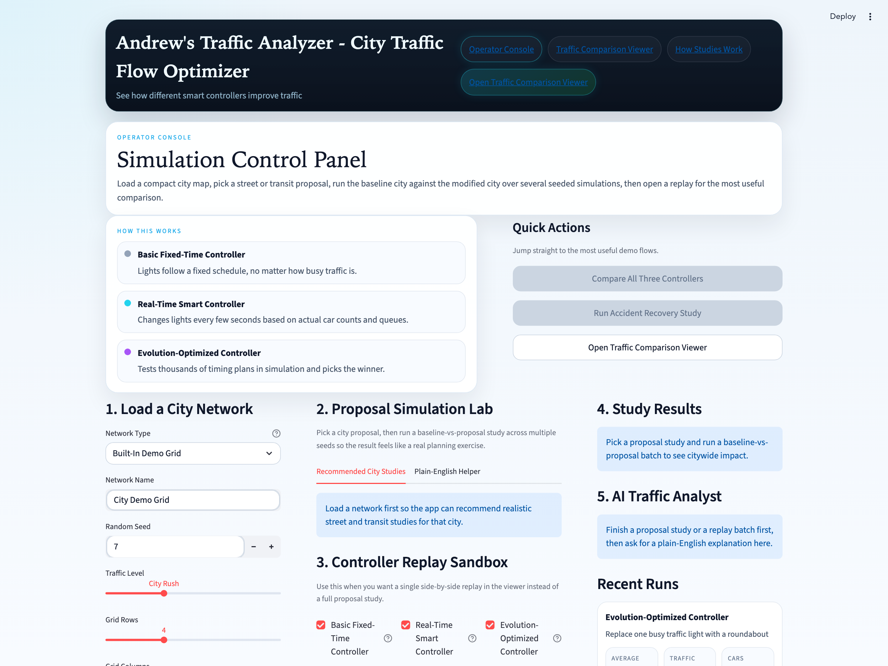
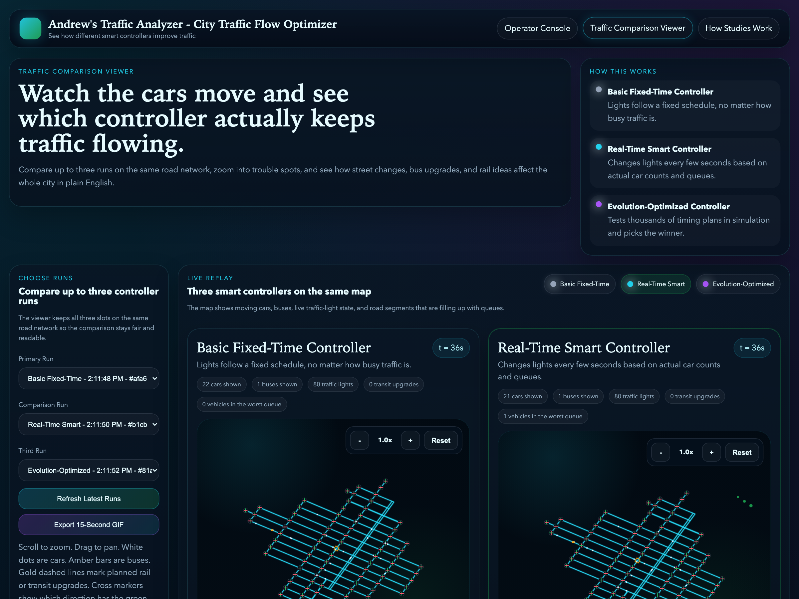

# Andrew's Traffic Analyzer
## One-Page Architecture Overview

Andrew's Traffic Analyzer is a compact digital-twin prototype for city traffic planning. It is designed to answer two kinds of question that transportation teams care about: micro questions such as "which signal-control strategy moves traffic better right now?" and macro questions such as "what happens if we replace this signal with a roundabout, add a connector, increase bus service, or introduce a rail-oriented alternative?" The system does not try to be a production traffic-management platform. Instead, it is intentionally optimized for comparative analysis, repeatability, and demo usability: load a city, generate demand, apply a proposal, simulate several control strategies, and explain what changed in plain English.

The architecture is deliberately layered so each responsibility stays clear. A network loader creates either a deterministic synthetic grid or a compact real neighborhood imported from OpenStreetMap. A demand generator then creates repeatable travel patterns across that network, including car trips, hotspot pressure, and simplified transit service. A scenario service converts structured proposals into explicit network or demand mutations. The simulation runtime advances vehicles through the network second by second, while the controller layer chooses signal phases without owning the movement rules. Metrics, telemetry, and replay artifacts are stored so the same run can be analyzed later, and two user surfaces sit on top of that core: a Streamlit operator console for launching studies and a React comparison viewer for replaying and explaining the results.

This architecture is a good fit for the assignment because it preserves the spirit of a true digital twin without requiring the operational weight of a city-scale stack. It is local, deterministic, and fast enough to run multiple meaningful studies on normal hardware in a short interview window. That matters. A heavier architecture based on full geospatial infrastructure and higher-fidelity simulation could be justified in a production setting, but it would have made the demo materially slower to run, harder to debug, and harder to explain live. The current implementation therefore optimizes for credibility per unit of complexity: it is realistic enough to show trade-offs among controllers and scenario proposals, while still being lightweight enough to demonstrate interactively.

The intelligence of the system lives primarily in the controller layer and scenario engine. The controller stack is intentionally progressive. It begins with a fixed-time baseline, adds simple actuated behavior, includes Webster's method as a classic traffic-engineering benchmark, uses max-pressure as the primary adaptive controller, and includes a genetic-algorithm search layer for simulation-in-the-loop signal-plan optimization. That progression makes the results both technically useful and easy to explain. At the same time, the scenario layer makes the product feel like more than a traffic-light demo: it supports studies such as accident response, signal-to-roundabout conversion, new connectors, bus-service upgrades, and rail-oriented mode shifts. An AI analyst then summarizes results after the fact, which improves clarity without putting opaque AI logic inside the control loop itself.

<table>
  <tr>
    <td width="48%">
      
      
<em>Operator console used to load a city, configure proposals, launch controller runs, and start comparative studies.</em>

    </td>
    <td width="48%">
      
      
<em>Comparison viewer showing multiple controllers on the same network with live replay, metrics, and a plain-English explanation surface.</em>

    </td>
  </tr>
</table>

What is deliberately simplified is just as important as what is implemented. The system does not ingest raw camera feeds, optimize full bus schedules, or run a metropolitan-scale simulation. Buses and rail are represented as demand and mode-shift abstractions, incidents are modeled as capacity or speed disruptions, and the default persistence layer is SQLite even though the schema is shaped so it can grow into a Postgres or PostGIS-backed design later. These were intentional trade-offs. For a take-home, the most important thing was to show the right system boundaries, support both operational and planning use cases, and produce results that are inspectable, repeatable, and visually understandable.

In short, this project is best understood as a focused architecture prototype: small enough to run locally, but structured like a real transportation-analysis product. It demonstrates how traffic control, scenario planning, simulation, replay, and AI-assisted explanation can work together in a coherent system without hiding behind unnecessary infrastructure.
